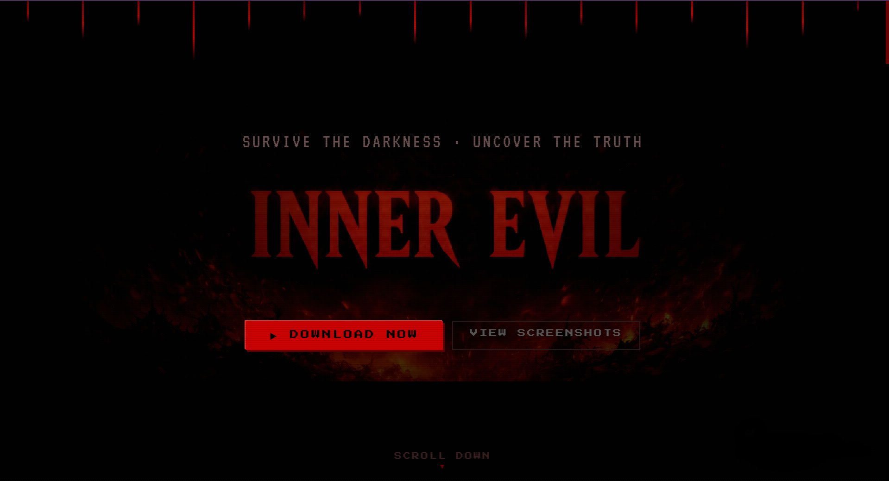
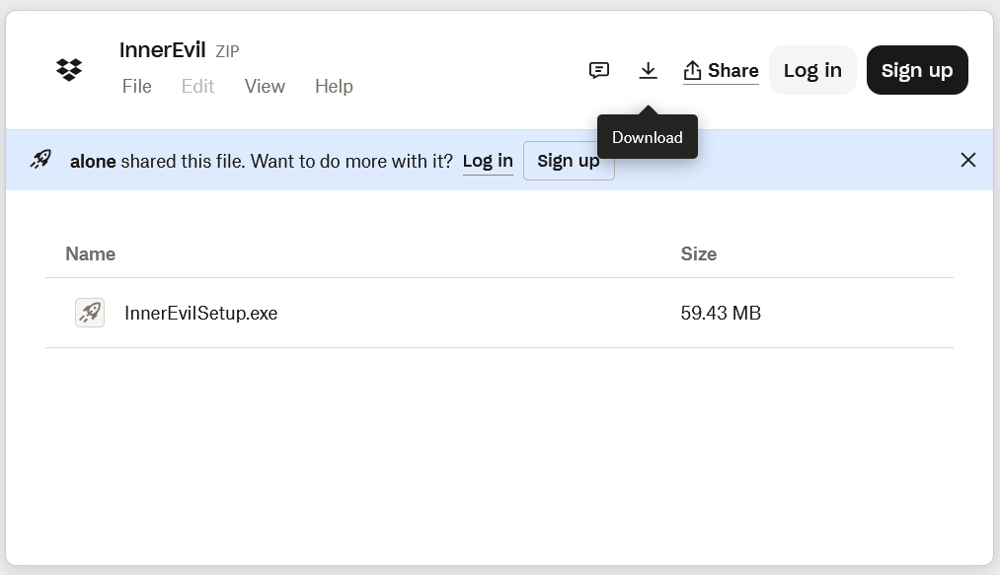

# Reverse Engineering MaaS 

## Overview

Found this malware because of a "try my game" social-engineering message on Discord. Wanted to figure out what it does / how it works.

At first I thought it would take me a few hours to figure it out, but I was wrong. After a few days of spending countless hours on it, I have reconstructed the code and now know how it works.

In this document I will explain what data it steals, how it steals said data and what methods it uses to obfuscate its code.

## Backstory

Someone I knew on Discord messaged me and asked me if I could try their game out for 5 minutes. Told me it was their project for college. Although, once I asked a few question about it, they quickly removed me from their friends list. All of this was very suspicious so I went in thinking that it had some sort of malware. 

I first visited their youtube video game trailer that they have sent to me. The video had a few thousand views and a decent amount of positive comments. In the comments, they included their website. The website looked well made, although it was most likely made with ChatGPT as the code included an image with ChatGPT in its file name.

The download button just linked you to a Dropbox download. The file name was `InnerEvilSetup.exe` with the size of `59.43MB`. The author of this Dropbox link was `alone`, clearly showing that most "hackers" are losers.

*You should always use a VPN or TOR when entering shady websites*

<table>
  <tr>
    <th>Website</th>
    <th>DropBox Downlaod</th>
  </tr>
  <tr>
    <td></td>
    <td></td>
  </tr>
</table>

## How I extracted the code from a .exe

I did not want to infect my whole system, so I used VirtualBox. 

Since `.exe` files are just archived files, I could have changed the file format from `.exe` to `.zip` and I could have extracted it that way, but I used something called `Universal Extractor` to extract the files for me.

At first glance, the files looked like something from a normal Electron app, but it also included a folder `script/`


The file names were `crypted.js` and `discord-injection-obf.js`, so from the file names it tells us that it targets discord.

Although these two files were not the main files, they were just loaders. They were also encrypting the next code instructions by doing `byte XOR 0xDA` and afterwards decrypting it with pbkdf2Sync(). Once decrypted it runs `new Function()` with the whole decrypted code stored in a variable. So there are two ways that I have managed to get the same next stage code:

1. Hooking into the code before `new Function()` and extracting the real payload source.

```js
try {
	global.Function = function (...args) {
		const functionBody = args[args.length - 1];
		if (typeof functionBody === 'string' && functionBody.length > 100) {
			require('fs').writeFileSync('capturedPayload.txt', functionBody);
		}
		throw new Error('new Function() stopped before execution');
	};
	require('./discord-injection-obf.js');
} catch (err) { console.log('Execution stopped:', err.message); }
```

2. Deobfuscating the code and printing the payload source. Although this takes more time and you have to deobfuscate it correctly otherwise you will just get nonsense.

## Stage Breakdown

### Stage 1: Discord Loader

This stage is heavily obfuscated and mainly acts as a loader. Before execution, it decrypts the next payload and passes the recovered JavaScript source into `new Function()`. This allows the next stage to run dynamically without appearing as a normal readable file on disk.

### Stage 2: Crypter Loader

This stage uses the same general idea as Stage 1.

### Stage 3: Stealer core

This stage contains the main data-theft logic. It targets Discord/account data, browser data, cookies, passwords, sessions, wallet-related files, and system identifiers. It also prepares stolen data for reporting and sends it to the attacker's infrastructure using JSON POST requests.

### Stage 4: Reproting and Sessions

This stage handles communication with the backend/C2 infrastructure. It reports victim information, sends collected data, and includes panel/session features that appear designed to let the operator monitor or interact with infected systems.