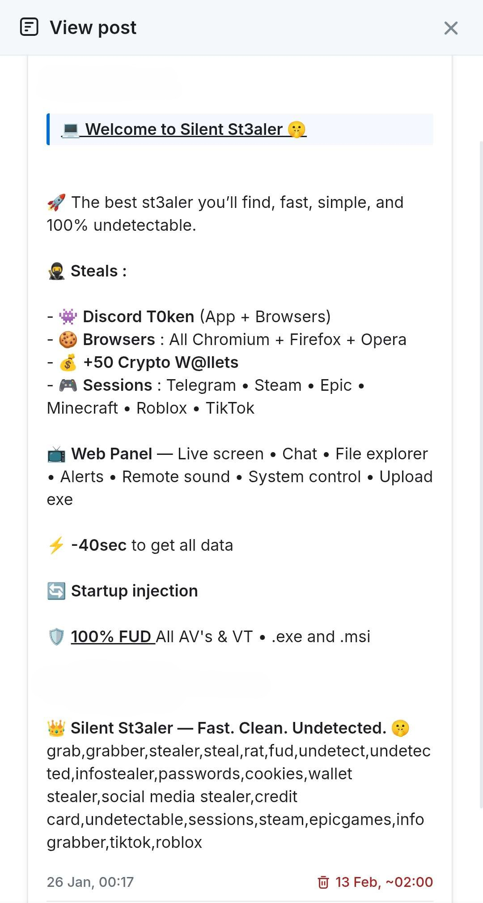

# Reverse Engineering Malware-as-a-Service (MaaS) 

## Overview

Found this malware because of a "try my game" social-engineering message on Discord. Wanted to figure out what it does / how it works.

At first I thought it would take me a few hours to figure it out, but I was wrong. After a few days of spending countless hours on it, I have recovered much of the code and traced its main behavior.

In this document I will explain what data it steals, how it steals said data and what methods it uses to obfuscate its code.

## Backstory

Someone I knew on Discord messaged me and asked me if I could try their game out for 5 minutes. Told me it was their project for college. Although, once I asked a few questions about it, they quickly removed me from their friends list. All of this was very suspicious so I went in thinking that it had some sort of malware. 

I first visited their YouTube video game trailer that they have sent to me. The video had a few thousand views and a decent amount of positive comments. In the comments, they included their website. The website looked well made.

The download button just linked you to a Dropbox download. The file name was `InnerEvilSetup.exe` with the size of `59.43MB`. The author of this Dropbox link was `alone`.

<table>
  <tr>
    <th>Website</th>
    <th>Dropbox Downlaod</th>
  </tr>
  <tr>
    <td></td>
    <td></td>
  </tr>
</table>

Once the victim regained their credentials, they apologized and told me what had happened.

In the email shown below, the sender demanded $150 from the victim in exchange for returning accounts and deleting stolen information. They claimed that malware was still running on the victim's computer and threatened further data theft if the demand was not met.


## How I extracted the code from an .exe

I did not want to infect my whole system, so I used VirtualBox. 

I used something called `Universal Extractor` to extract the files.

At first glance, the files looked like something from a normal Electron app, but it also included a folder `script/`


The file names were `crypted.js` and `discord-injection-obf.js`, the file names suggest that it targets Discord.

Although these two files were not the main files, they were just loaders. The loader in `discord-injection-obf.js` first joins the embedded Base64 chunks, decodes them, and applies XOR with 0xDA to each byte. This produces a Base64-encoded ciphertext.

It then uses pbkdf2Sync() to derive a 32-byte key from a hardcoded password and salt. The payload is decrypted using AES-256-CBC: `crypto.createDecipheriv()` creates the decipher with that key and the stored initialization vector, while `decipher.update()` and `decipher.final()` perform the decryption.

Finally, the recovered JavaScript is passed to new Function(), and the resulting function is called to execute it.

```js
// embedded payload chunks, password, salt and IV omitted.

const ciphertextB64 = Buffer.from(
    encodedPayloadChunk1 + encodedPayloadChunk2 + encodedPayloadChunk3,
    'base64'
).map(byte => byte ^ 0xDA).toString('utf8');

const key = crypto.pbkdf2Sync(
    password,
    Buffer.from(saltB64, 'base64'),
    50000,
    32,
    'sha256'
);

const decipher = crypto.createDecipheriv(
    'aes-256-cbc',
    key,
    Buffer.from(ivB64, 'base64')
);

const payloadSource =
    decipher.update(ciphertextB64, 'base64', 'utf8') + decipher.final('utf8');
```

There are two ways that I have managed to get the same next stage code:

1. Hooking into the code before `new Function()` and extracting the real payload source. The snippet I provide does not make you safe from harm as the code before new Function() still runs. 

```js
try {
	global.Function = function (...args) {
		const functionBody = args[args.length - 1];
		if (typeof functionBody === 'string' && functionBody.length > 100) {
			require('fs').writeFileSync('capturedPayload.txt', functionBody);
		}
		throw new Error('new Function() stopped before execution');
	};
	require('./discord-injection-obf.js');
} catch (err) { console.log('Execution stopped:', err.message); }
```

2. Deobfuscating the code and printing the payload source. Although this takes more time and you have to deobfuscate it correctly otherwise you will just get nonsense.

## Stage Breakdown

Stage 1 -> Stage 3
Stage 2 -> Stage 4

### Stage 1: Discord Loader

The Discord loader contains a JavaScript payload protected by the encoding and encryption layers described above. Everything is included in the loader, thus allowing the payload to be recovered without contacting an external server.

After decryption, the loader passes the recovered source to `new Function()` and calls the resulting function. The decrypted code is passed directly into the function constructor without being saved as a separate JavaScript file.

Removing the outer encryption layer exposes another layer of JavaScript that is obfuscated.

*The payload recovered is the code analyzed in Stage 3.*

### Stage 2: Crypted Loader

This stage uses the same general idea as Stage 1. I have not deobfuscated this code, so I have no idea if it uses the same values as the first loader.

*The payload recovered is the code analyzed in Stage 4.*

### Stage 3: Discord Injection

The payload recovered from Stage 1 is designed to run inside Discord’s Electron environment. Its main purpose is to capture Discord credentials and authentication tokens by monitoring selected API requests and responses.

It selects the first available `BrowserWindow`, attaches to its `webContents.debugger`, and enables network monitoring with `Network.enable`. When a `Network.responseReceived` event matches its configured URL filters, it retrieves the response body using `Network.getResponseBody` and the request body using `Network.getRequestPostData`.

For login and registration requests, this gives the payload access to credentials submitted in the request and the authentication token returned in the response. These values are passed to the `EmailPassToken()` function. If a login response does not contain a token, the code temporarily stores the submitted login and password.

The reporting function uses the captured token to request additional account information, including the account’s phone number, badges, MFA status, and the presence of saved payment methods. It also retrieves the victim’s public IP address. These details are combined with the captured credentials and token into a structured report, then sent as JSON to the reporting endpoint.

The file ends with `module.exports = require('./core.asar')`, which suggests that the injected code is intended to run alongside Discord’s original core module.

### Stage 4: Data Theft and Remote Control

This contains the main routines for collecting stored credentials and session data, reporting the results and remotely interacting with the victim's system.

The collection logic is divided across several functions. `GetToken()` searches for stored Discord tokens, while `scanDiscordBackupCodes()` searches for files containing backup codes. `runBrowserExtraction()` targets browser cookies, saved passwords, autofill information, and stored payment card data. Other routines target wallet-related files and application data from Telegram, Steam, Minecraft, Valorant, Roblox and TikTok.

Several routines save their results locally, package them into ZIP and upload them to GoFile. The reporting code sends JSON messages to the API, including collected account information, system details and links to uploaded files.

Some routines also attempt to establish persistence through scheduled tasks and startup entries. Additionally, some attempt to obtain administrator privileges and add Windows Defender exclusions.

The remote-control component includes a WebSocket client and handlers for commands received from the backend. These handlers cover screen capture and streaming, file browsing and downloads, PowerShell command execution, and downloading and running additional executables. Other commands display messages, play sounds, open URLs, or trigger another round of data collection.

These routines indicate that the component was designed to function as both an information stealer and a remote access trojan (RAT).

## How Silent Stealer was advertised

During the investigation, I found a promotional post on Telegram for the malware. It was not difficult to find since they use `mainsilent` in the code.



## Conclusion

This is not intended to be a full report. If you’re curious, Related research links to a more detailed analysis. I did this for fun and curiosity, although it took far more hours out of my life than I expected.

Working through the payload made me realize how scary malware can be. Some parts of the code felt patched together, but I have not established whether they were adapted from another stealer.

Some parts of the reconstruction remain incomplete. The capabilities described are based on the recovered source

## Related research

While preparing this, I found Ransom-ISAC’s [ShinyHunters: Silent Malware as a Service (MaaS)](https://ransom-isac.org/blog/shinyhunters-silent-maas/), published on May 26, 2026. Their report examines `Illusion-2.6.5-setup.exe` and provides further analysis of Silent Stealer.
